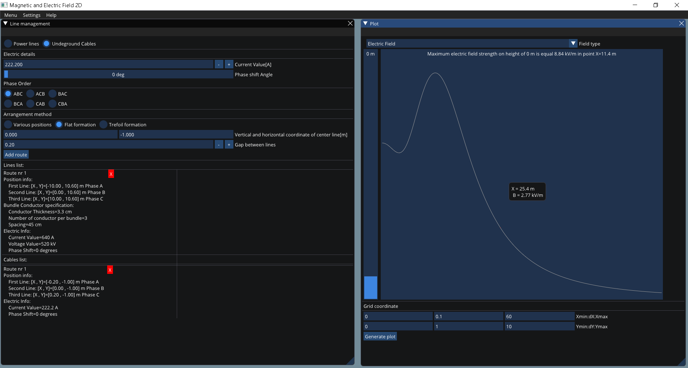

# MagneticAndElectricField2D
This software allow to calculate magnetic and electric field in two dimensional arrangement of three phase power lines or underground cables.

## Used technologies and interface presentation
Application was written in Julia programming language and it uses Julia CImGui wrapper. It has a resposive windows and plot, many input options that allow to input data cables in straight way by raw coordinates or by trefoil or flat formation.
It also has main menu bar in which we can change properties of interface view and style. The program is just demo version. The app will be improved and more modules will be added in the future.

## Calculation base and performed tests
Program calculations are based on: 
- "EPRI AC Transmission Line Reference Book-200 kV and Above, Third Edition" 
- Zenczak Michal "Analysis of electric and magnetic fields near power transmission lines and other electrical power equipment" 

The calculations were entirely verified on a large number of tests including all examples contained in:
- "EPRI AC Transmission Line Reference Book-200 kV and Above, Third Edition"
- "CYMCAP 7.2 Reference Manual and Users Guide"

